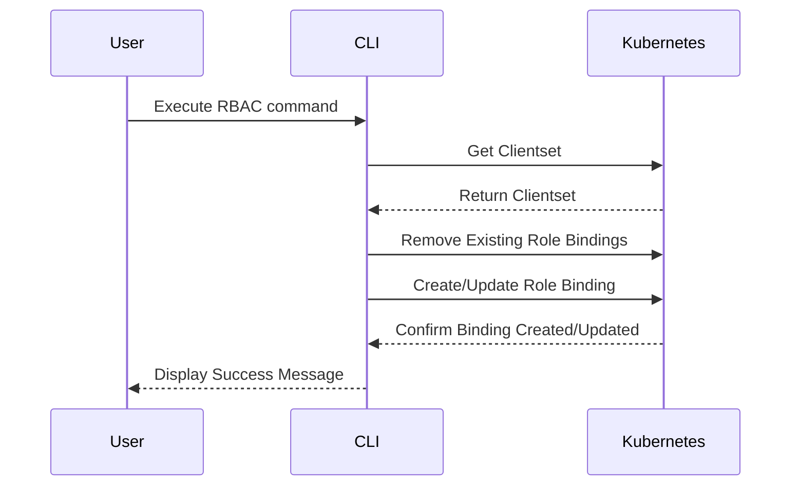

# Kubeon - Kubernetes RBAC Management Tool and Namespace Quotas

## Overview

`kubeon` is a CLI tool for managing RBAC in Kubernetes, setting namespace quotas, and creating Kubeconfig files for users. This tool simplifies the process of managing Kubernetes permissions and resources.



## Usage

### RBAC Management

```sh
# Create a RoleBinding for a user
kubeon rbac [username] [role] --namespace [namespace]
```

```sh
# Update a RoleBinding for a user
kubeon update-rbac [username] [role] --namespace [namespace]
```

### Namespace Quotas

```sh
# Define quotas for a namespace
kubeon namespaces-quotas [namespace] --limits-cpu [cpu] --limits-memory [memory] --requests-cpu [cpu] --requests-memory [memory]
```

### Kubeconfig Management

```sh
# Create a Kubeconfig for a new user
kubeon create-kubeconfig [username] --role [role] --namespace [namespace]
```

```sh
# Delete a Kubeconfig for a user
kubeon delete-kubeconfig [username]
```

## Build the Application

To build the application, use the following command:

```sh
go build -o kubeon
```

### Move the Binary to /usr/local/bin

After building the application, move the binary to bin for easy access:

```sh
sudo mv kubeon /usr/local/bin/
```
### Example

Here is an example of how to use the `kubeon` tool:

```sh
# Create a Kubeconfig for user1 with view role in the test namespace
kubeon create-kubeconfig user1 --role=view --namespace=test

# Update the RBAC role for user1 to admin in the test namespace
kubeon update-rbac user1 admin --namespace=test

# Define resource quotas for the test namespace
kubeon namespaces-quotas test --limits-cpu 2 --limits-memory 4Gi --requests-cpu 1 --requests-memory 2Gi
```